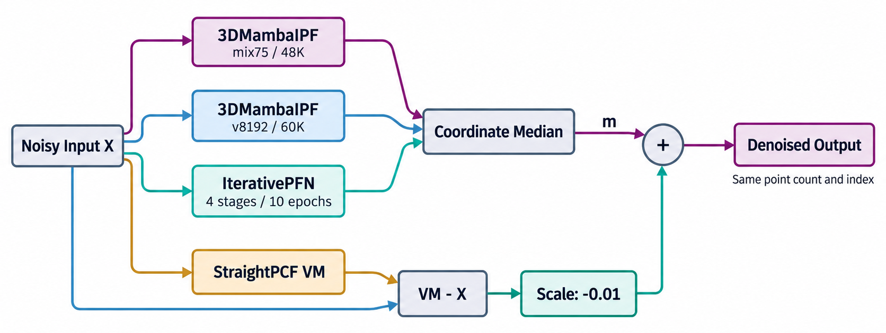

<h1 align="center">NKAI · Point Cloud Denoising</h1>
<p align="center"><b>多模型协同的三维点云降噪 · Jittor 2026</b><br>
南开大学 NKAI ｜ 第六届计图人工智能挑战赛 · 赛道二 · 第 10 名</p>

<p align="center">
  
  
  
  <a href="https://github.com/July-h5kf3/Jittor-2026/releases/tag/v1.0.0"></a>
</p>

<p align="center">
  <a href="#方法概览">方法概览</a> ·
  <a href="#快速开始">快速开始</a> ·
  <a href="docs/REPRODUCE.md">复现指南</a> ·
  <a href="docs/WEIGHTS.md">模型权重</a> ·
  <a href="docs/TRAINING.md">训练说明</a> ·
  <a href="docs/THIRD_PARTY.md">引用与许可</a>
</p>

<p align="center"></p>

两个 **3DMambaIPF** 成员与一个 **IterativePFN** 提供主体预测，**StraightPCF VM** 提供参考位移。我们在 Jittor 上实现成员推理、重叠 Patch 软融合与逐坐标中位数融合，并固定小幅 VM 残差校正。

> **当前发布**：最终方案源码、四成员 checkpoint、SHA-256 校验、复现脚本与训练配置说明。数据集通过赛事渠道获取。最终赛事排名：第 10 名。

## 方法概览

| 层次 | 设计 | 实现入口 |
|---|---|---|
| 成员训练 | 相同 Mamba 架构采用不同数据构造与 checkpoint，加入 IPFN 结构差异 | [训练说明](docs/TRAINING.md) |
| 局部拼接 | 重叠 Patch 根据归一化中心距离进行 softmax 加权 | [Mamba 推理](solution/code/mamba/jittor_core/infer.py) · [IPFN 推理](solution/code/ipfn/infer.py) |
| 模型融合 | 三个主体按原始点索引对齐，逐坐标取中位数 | [融合脚本](solution/fusion/fuse_global_m3i1_vf_n01.py) |
| 参考校正 | VM 位移以固定 −0.01 系数修正中位数 | [整体方法](METHOD.md) |
| Jittor 实现 | `jt.code` 选择性扫描前向/反向、状态检查点重算、高维 KNN | [算子目录](solution/code/mamba/jittor_core/plr3d/ops) |

$$\widehat X = \operatorname{median}_{\mathrm{coord}}(M_{48K},M_{60K},I_{1024}) - 0.01\,(V-X)$$

这里的中位数只包含三个主体预测；VM 不参与中位数。所有输出保持输入点数和原始索引。

## 快速开始

目标环境为 **Linux + NVIDIA CUDA**，Python 3.10、Jittor 1.3.11.0。Windows 可用于阅读源码，CUDA 推理请使用 Linux 环境。

```bash
git clone https://github.com/July-h5kf3/Jittor-2026.git
cd Jittor-2026/solution

conda create -n nkai-jittor python=3.10 -y
conda activate nkai-jittor
pip install -r requirements.txt

# 下载四成员权重，并逐文件核验 SHA-256
python tools/download_weights.py

# 指向你已下载的官方测试数据：<INPUT_ROOT>/shapenet/.../noisy.npy
export INPUT_ROOT=/path/to/official_test
python tools/prepare_keys.py --input-root "$INPUT_ROOT" --expected-count 200
python tools/check_release.py --input-root "$INPUT_ROOT"

# 单 GPU 顺序执行四成员；首次运行会编译 Jittor CUDA 算子
WORLD_MAMBA=1 WORLD_IPFN=1 WORLD_VM=1 bash scripts/run_reproduce.sh
```

结果输出至 `solution/result.zip`，逐点预测位于 `solution/preds/`。提交打包器对应 200 个 `btest_*` 样本、每例 50,000 点；环境准备、分成员运行与自定义数据说明见[复现指南](docs/REPRODUCE.md)。

## 四成员配置

| 成员 | 数据构造/作用 | 发布权重 |
|---|---|---|
| Mamba mix75 | ≤1,024 原始顶点；75% 概率进行 [0.95, 1.05] 尺度抖动 | 48,000 step |
| Mamba v8192 | ≤8,192 原始顶点；关闭尺度抖动 | 60,000 step |
| IterativePFN 1024 | 四阶段 EdgeConv；阶段监督与度量代理 | epoch 10 |
| StraightPCF VM | 固定参考残差；不进入中位数 | epoch 10 |

训练 patch 为 1,000 点；主体推理 patch 为 2,000 点。数据构造中的原始顶点数与 patch 大小是不同参数。训练入口、配置与准备步骤见[训练说明](docs/TRAINING.md)。

## 仓库结构

```text
solution/                  当前最终方案
├── code/                  Mamba / IPFN / VM 的 Jittor 源码
├── fusion/                三主体中位数与 VM 残差
├── scripts/               分成员推理与结果打包
├── tools/                 权重下载、数据清单与发布检查
├── weights/               小型配置与 SHA-256 清单；大权重见 Releases
└── a_board/               历史复审材料，保留来源链
docs/                      复现、训练、权重、引用与框架图
src/ · configs/ · scripts/  原仓库早期实验代码，保留供追溯
```

根目录旧 `src/` 流程不是本次最终方案的运行入口。历史首页与方法文档见 [docs/history](docs/history)，实验记录见 [EXPERIMENTS.md](EXPERIMENTS.md)。

## 发布与验证

- [v1.0.0 权重发布](https://github.com/July-h5kf3/Jittor-2026/releases/tag/v1.0.0)：四个成员、训练元数据与校验清单。
- CPU 检查：`python -m unittest discover -s solution/tests -v`。
- 数据不入库，预测与编译缓存不入库；所有 checkpoint 以 manifest 定位和核验。
- 有关错误或复现差异，请在 [Issues](https://github.com/July-h5kf3/Jittor-2026/issues) 提供环境、完整命令及报错。

## 团队与引用

**NKAI · 南开大学**：李佳璞、刘迪乘、曲恒睿。

感谢 [Jittor](https://github.com/Jittor/jittor)、[3DMambaIPF](https://github.com/TsingyuanChou/3DMambaIPF)、[IterativePFN](https://github.com/ddsediri/IterativePFN) 与 StraightPCF 的工作。本项目采用已有网络设计，并围绕 Jittor 实现、训练组织和推理融合进行整理与实现；不将参考模型结构作为本团队原创。

NKAI 自有新增代码按 [MIT](LICENSE) 许可；第三方组件、数据和模型遵循各自适用条款。来源与学术引用见 [THIRD_PARTY.md](docs/THIRD_PARTY.md) 和 [CITATION.cff](CITATION.cff)。
